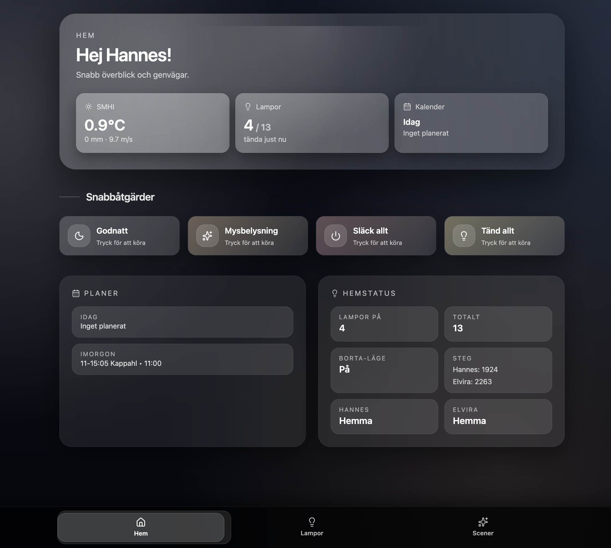
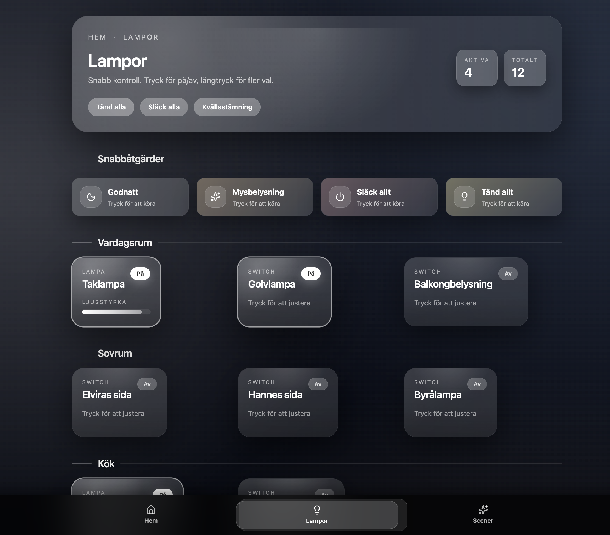
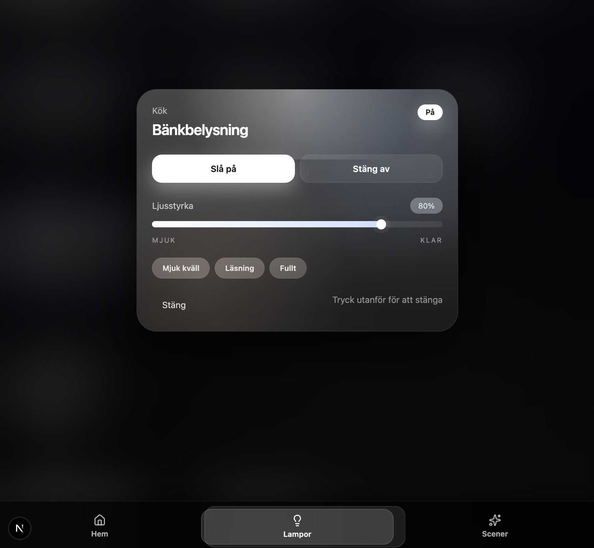
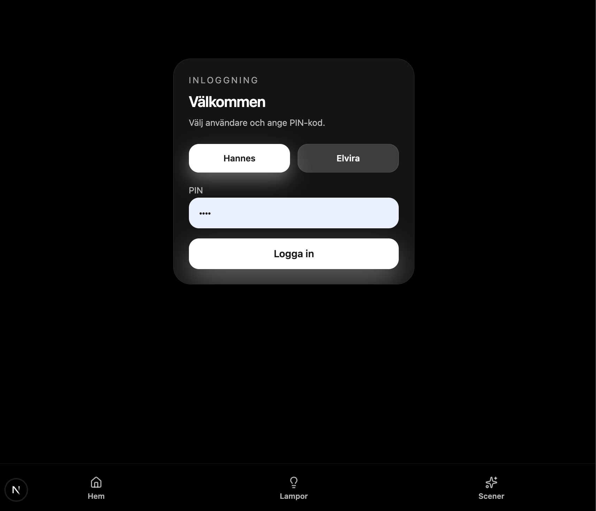
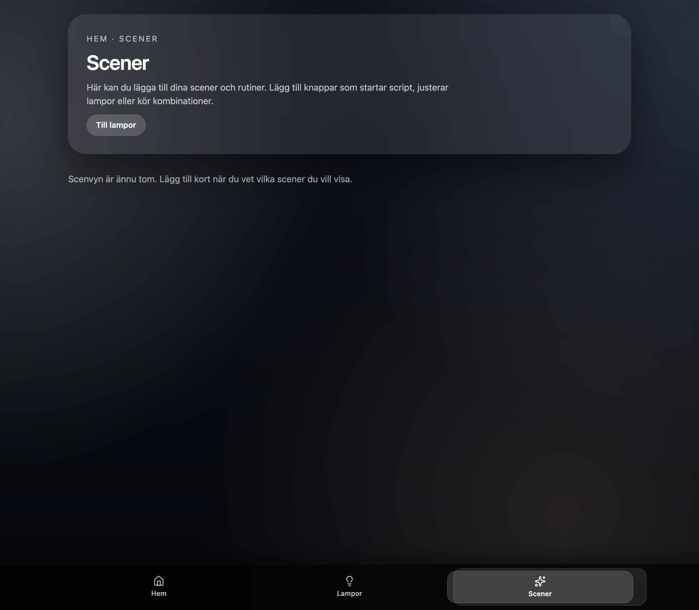

# HA Webapp

Next.js-app för Home Assistant-kontroll med glasig UI, PIN-inloggning, Cloudflare-tunnel och SMHI-väder.

## Funktioner
- Lampor/switchar från HA med live polling (var 15 s), snabbåtgärder och long-press modal.
- PIN-inloggning (Hannes/Elvira), middleware-skydd, logout.
- Hemdash med SMHI-temp/nederbörd/vind (poll var 3 min), HA-kalender, närvaro (device_tracker), bortaläge, steg.
- Bottom-nav (Hem/Lampor/Scener), responsiv layout.

## Krav
- Node 18+ (dev) på hosten.
- HA-token och HA-url i `.env.local`.
- (Valfritt) Cloudflare Tunnel för extern åtkomst.

## Install/Dev
```bash
git clone https://github.com/hannesassarsson/webapp_HA.git
cd webapp_HA/ha-webapp
cp .env.local.example .env.local   # skapa egen fil
npm install
npm run dev -- --hostname 0.0.0.0 --port 3000
```
Öppna http://localhost:3000 (eller host-IP:3000).

## Prod (manuellt)
```bash
npm run build
npm run start -- --hostname 0.0.0.0 --port 3000
```

## Miljövariabler (.env.local)
```
HA_URL=http://<din-ha>:8123
HA_TOKEN=<long-lived token>
AUTH_SECRET=<lång slumpad sträng>
HANNES_PIN=<pin>
ELVIRA_PIN=<pin>
SMHI_LAT=<lat>   # t.ex. 55.429
SMHI_LON=<lon>   # t.ex. 13.820
```
(.env* är ignorerad i git.)

## Cloudflare Tunnel (kort, exempel)
- `cloudflared tunnel login`
- `cloudflared tunnel create ha-webapp`
- `~/.cloudflared/config.yml`:
```yaml
tunnel: <tunnel-id>
credentials-file: /root/.cloudflared/<tunnel-id>.json
ingress:
  - hostname: <din-subdomän.dindomän.se>
    service: http://127.0.0.1:3000
  - service: http_status:404
```
- `cloudflared tunnel run ha-webapp`

## Screenshots
- Hem:  
  
- Lampor:  
  
- Popup (long press):  
  
- Inloggning:  
  
- Scener (placeholder):  
  

## Övrigt
- Debug-loggar mot HA är avstängda.
- För extra säkerhet: längre PIN + rate-limit, Cloudflare Access (SSO/OTP) framför tunneln.***
